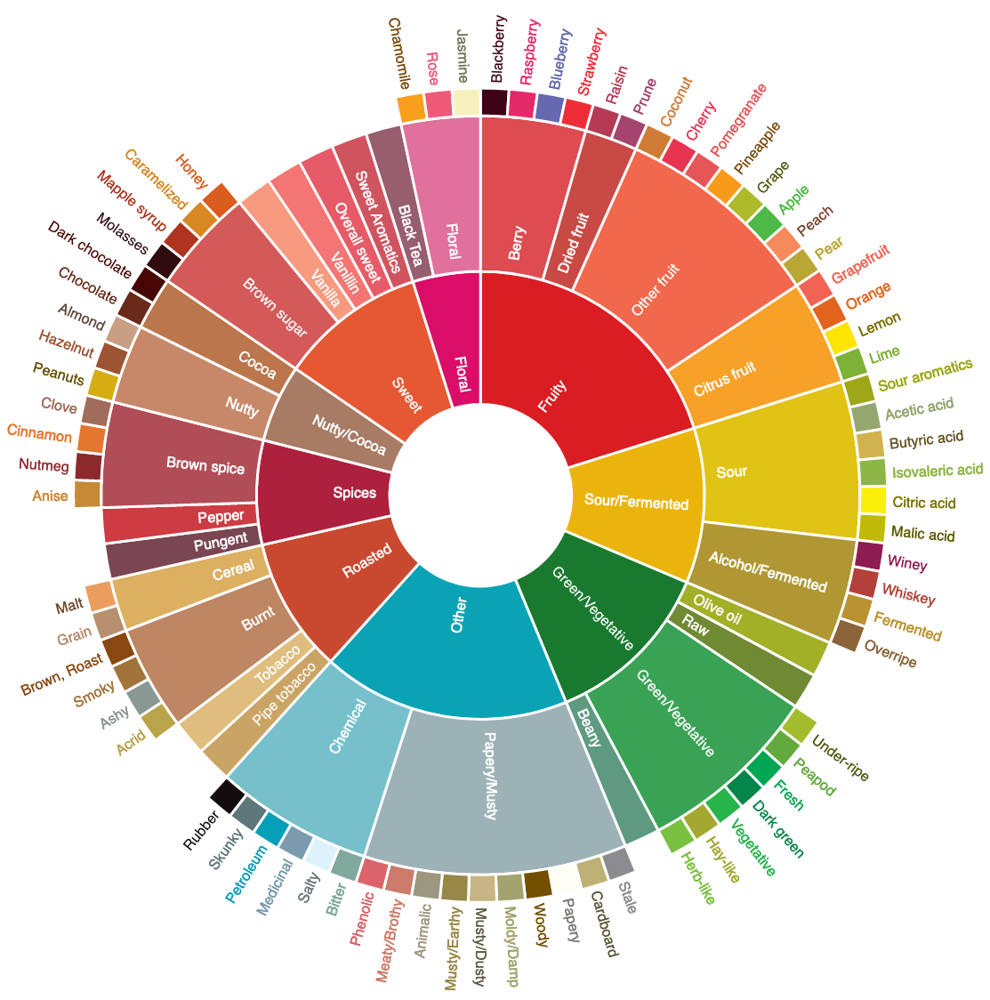
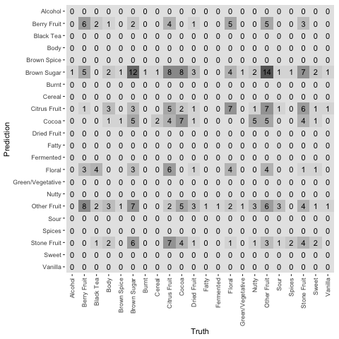
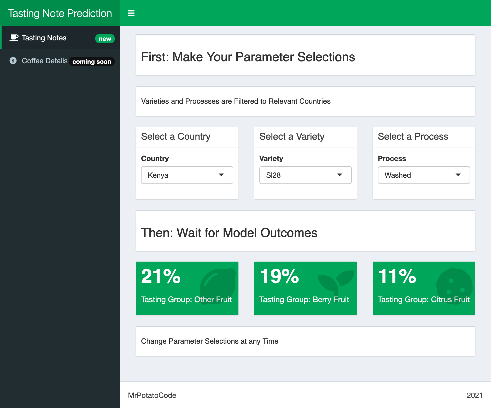

\newpage

```{r setup, echo=FALSE}
set.seed(42)
knitr::opts_chunk$set(echo = FALSE, message = FALSE, warning = FALSE, fig.pos = "!H", out.extra = "")
options(scipen=99999)
```


```{r libraries}
library(tidyverse)
library(data.table)
library(here)
library(kableExtra)
library(ggplot2)
library(ggthemes)
library(bookdown)
library(rworldmap)
```

```{r getdata, include=FALSE}
source(paste0(here::here(),"/scripts/build/01_get_data.R"), local = knitr::knit_global())
```

```{r cleandata, include=FALSE}
source(paste0(here::here(),"/scripts/build/02_clean_data.R"), local = knitr::knit_global())
```

```{r modeldata, include=FALSE}
source(paste0(here::here(),"/scripts/analyze/03_xgb_model.R"), local = knitr::knit_global())
```

```{r vizdata, include=FALSE}
source(paste0(here::here(),"/scripts/analyze/04_viz_data.R"), local = knitr::knit_global())
```

## Introduction

Coffee is consumed in every country, is the seventh most valuable agricultural product (Pendergrast, 2010), and supports the livelihood of 125 million people (Hoffmann, 2018). In many places, the daily coffee ritual signifies a start to the day and a nod to the productive buzz it imbues its consumer. Our appreciation for coffee has helped shape a complex landscape of horticulture, chemistry, food science, and globalised import-export economics. As a result, coffee has never tasted better. Our collective understanding of coffee information has led to phenomenal quality coffee beans and annual championships celebrating the labour and toil of farmers, producers, roasters, and baristas across the world.

### Background

Combining coffee and data science, this exploratory research aims to examine whether a specialty coffee’s Tasting Notes can be predicted by a gradient boosted algorithm based on the coffee's attributes (§Terminology). Several key research studies have explored the relationship between single-origin attributes and their Tasting Notes and thus sit as domain framework for technical applications made here. Exploring Tasting Notes is contingent firstly upon the acceptance of Tasting Notes as objective rather than subjective. This phenomenon has been well-noted by vintners and has likewise been researched with regard to specialty coffee (Croijmans et al., 2016). Research using blind taste and aroma tests generally supports consistency across highly trained panel tasters (Bhumiratana, 2011). The conclusions of Croijmans and Bhumiranta support the contention that Tasting Notes are a combined result of cupping experts’ training and linguistic ability to identify tastes through plain nomenclature. Cupping, following protocols  published by the Specialty Coffee Association (2003), serves as the only means for Tasting Note generation across all relevant studies. Standardized cupping routines were thoroughly explored as a case study in Rwanda by Goldstein (2011) and found to be reliable.

As such, this project is firmly rooted in scientific consensus that tasting notes are consistent in their generation and thus measurable by machine learning models. From this assertion, two previous experiments have explored single-origin coffee Tasting Notes. Firstly, _Coffee Terroir: Cupping Description Profiles and Their Impact Upon Prices in Central American Coffees_ (Conley and Wilson, 2018) combined country of origin and Tasting Notes within a Multiclass Classification Neural Network and examined the attribute coefficients via regression analysis. Secondly, research produced in a blogging side project by Jonathan Gagné (2019) at the University of Montreal exemplifies Varietal:Tasting Note and Processing:Tasting Note relationships.

This work aims to reinforce the anecdotal assumption that curation of speciality coffees creates certain tastes. The industry cultivates (even without intention) a collection of expected Tasting Notes for known attribute combinations that are perceived as desirable by consumers, thus reinforcing the industry’s expectations and further cultivation of Tasting Notes. The results of modelling, as well as its implications are important within the coffee industry; if known attribute combinations directly contribute to desirable Tasting Notes, producers may know the value of a crop before buying and roasting. This has noted implication on price, as well-studied by Traore et al. (2018), and exemplified in Pacamara and Caturra varieties.


### Terminology	

As the world’s appetite for coffee has grown, the coffee industry's "Third Wave" movement has flourished. The movement aims to treat coffee as an artisanal product that is carefully curated, where coffee quality is maximized at each stage: farming, producing, roasting, and selling (Rosenberg et al., 2018). There is an “obsession” with coffee’s taste and an often-altruistic approach to conducting business (Pendergrast, 2010). At its pinnacle, single-origin specialty coffee exists beyond a means to caffeinate and instead engages an increasingly discerning consumer.

Under the umbrella term, "Third Wave", coffees within this project are those that have been produced at a "single origin:" coffee that is sourced from a single producer, farm, or crop. These coffees are further graded as "speciality coffee": coffee of the species Coffea arabica that is within the top 20% of graded coffee produced worldwide. Two grading systems are generally utilized: Q-grading, as defined by the Specialty Coffee Association, and sieve grading, where larger beans are generally preferred (with the exception of single-seed “peaberry” coffees). Different countries utilize different grades (e.g. ‘AA,’ 16+, ‘Strictly High Grown,’ ‘Extra Fancy’) but top grades are well distinguished from middle- and commodity-grade coffees. 

Single-origin coffees are intended to be traceable, meaning consumers are privy to the production cycle before purchase. This data is represented by a core of common attributes: 1) Country and region of production; 2) Variety; 3) Harvest characteristics; 4) Processing; 5) Taste; and 6) Roast. Full descriptions of these attributes and their definitions can be found in Appendix A.

## Data

No publicly available coffee dataset was available for this project. **Diagram 1** shows the end-to-end process employed to collect, analyse, model, evaluate, and present this data. This composed of several web scraping processes (§Data Collection) that were then automated and combined into a stable dataset. This dataset was placed alongside a conformed set of Tasting Notes (§Data Conformity) before modelling.

```{r workflow, fig.align="center"}
DiagrammeR::grViz(paste0(here::here(),"/scripts/analyze/05_model_flow.dot"))
```

### Data Collection

Coffee data was scraped from four websites over the course of three months, comprising 550 unique coffees from 106 roasters. Data scraping varied by website format: some websites organized each coffee by roaster, so several scrapers were built to scrape data from roasters with consistent formatting across weeks; others were large collections of coffees that were scraped in entirity from top to bottom. Websites were selected by ease of scraping and quality of coffee offerings. Scrapers were generally run once a week and duplicate coffees were discarded, if there were any. Attributes varied by websites and roaster, but core attributes were generally present. Coffees marked as blends, espressos, and/or decaf were removed.  

These scrapers were automated with GitHub Actions to run on a weekly or monthly basis, depending on the frequency at which the coffees were updated on their respective websites. Each scraper produced a .csv file per roaster or site. These .csv files are then added to the existing data, and any duplicates removed. One website, not suitable for scraping but of excellent data richness, had coffee data manually collected from it. Coffee models became significantly more reliable around 500 coffees, so this manual collection was necessary to help achieve this within threshold. 

Data Collection proved a major limitation to this project. Coffee data collection should continue throughout the year to accommodate for coffee harvesting sesasons throughout the world. Brazil, the world's largest producer of arabica grade beans, is signficantly underrepresented due to the timing of data collection. Furthermore, scraped websites were inconsitent in their coffee listings. Coffee attributes present in one week were not guarenteed for another, nor was the order in which the attributes listed. Data that was unable to conform to the established standards was discarded before modelling in order to prevent erroneous variable relationships (such as a country being listed as a process).

### Data Conformity   

To facilitate the primary focus (predicting Tasting Notes), a conformed table based on the Specialty Coffee Association Taster's Flavor Wheel (2016) and World Coffee Research Sensory Lexicon (2017) created a hierarchial categorization for Tasting Notes. Tasting Notes were placed into larger Tasting Groups. Tasting Groups were placed into larger Tasting Traits. **Table \@ref(tab:SCAfru)** provides a sample of this relationship for six Tasting Notes within the "Fruity" Tasting Trait. 

{width=50%}

New Tasting Notes were added each time the data collection process occurred. A total of 577 Tasting Notes presently exist within 31 Tasting Groups and 10 Tasting Traits. **Figure \@ref(fig:lollipops)** shows the number of Tasting Notes in each Tasting Group, where Tasting Traits are represented by each coloured dot. Not all Tasting Notes were observed within the dataset: some were listed by the Specialty Coffee Association Taster's Flavor Wheel, others were added in anticipation of future coffees (for example, adding "raspberry jam" after "strawberry jam" was observed in the dataset). 427 distinct Tasting Notes were observed in the dataset.
  
```{r SCAfru}
citr <- sample(x = SCAA_Notes %>% filter(Trait == 'Fruity') %>% 
                                 select(Note) %>%unique() %>% unlist(),
                                 size = 6, replace = FALSE)
SCAA_Fake <- subset(SCAA_Notes, Note %in% citr) %>% select(-l_note) %>% 
        mutate(Note = str_to_title(Note)) %>% rename_all( ~ paste0("Tasting ", .x))
kable(SCAA_Fake, caption="Sample SCAA Tasting Wheel Rows", booktabs = TRUE, linesep= "") %>% 
  kableExtra::kable_styling(latex_options = c("stripped", "HOLD_position"))
```
  
```{r lollipops, fig.height=3.3}
g <- SCAA_Notes %>% group_by(Trait,Group) %>% summarise(n=n()) %>% arrange(desc(n)) 

ggplot(g, aes(x=reorder(Group, n) ,y =n, colour = Trait, fill = Trait))+
  #geom_bar(stat="identity") +
  geom_segment(aes(xend=Group, yend=0), colour = "grey") +
  geom_point(size=3.2) +
  ggtitle("Hierarchy of Tasting Notes, Groups, and Traits") + 
  ylab("Number of Tasting Notes") +
  xlab("Tasting Group") +
  coord_flip() + 
  theme_clean() +
  #scale_colour_manual(values = c("#372772","#f19953","#0075f2","#e15554","#86bbd8","#fde8c3","#748b75","#730f07","#da8c07","#280003"))
  #scale_colour_manual(values = c("#280003","#034732","#bb4430","#7daf8f","#00458f","#bc9cb0","#f19953","#730f07","#86bbd8","#da8c07"))
  #scale_colour_manual(values = c("#730f07","#034732","#280003","#7daf8f","#bc8e5c","#70b5ff","#bc9cb0","#f19953","#86bbd8","#da8c07"))
  #scale_colour_manual(values = c("#220901","#941b0c","#af3508","#f6aa1c","#034732","#47745c","#8ba085","#86bbd8","#2660a4","#372772"))
  #scale_colour_manual(values = c("#280003","#606d5d","#bc9cb0","#86bbd8","#f6ae2d","#bb4430","#ffe1a8","#2660a4","#f19953","#372772"))
  scale_colour_brewer(palette="Spectral") 
  #scale_fill_brewer(palette="PRGn") 
```

Adding Tasting Notes to the conformed table introduces some subjectivity. While many Tasting Notes were obvious (e.g. black currant is a Berry Fruit), others were difficult to place within a single category (e.g. chocolate orange). Consideration was made to avoid adding any Tasting Traits or Tasting Groups, instead finding space within existing Tasting Groups. Furthermore, some coffee Tasting Notes were less standard, occasionally showing regionality (e.g. pouding chomeur from a Montreal roaster) or brand names (e.g. Kit-Kat). This limitation is less impactful in the model of this study, which predicted Tasting Groups rather than individual Tasting Notes, but would need to be addressed by larger dataset volume or stricter Tasting Note filters (i.e. only accepting certain standard values).

Additionally, the World Coffee Research program's Arabica Coffee Varieties (2019) catalog was used to help standardize coffee varieties. Because the catalog does not cover all countries within the dataset, the most frequent varieties from those countries were included in modelling. Less frequent varities, when valid, should be included as the dataset becomes larger. A total of 15 distinct varieties were used within the modelling process.

### Dataset

Scraped .csv files were flexible enough to allow for significant variance in coffees. By nature, coffees are curated by humans; their coffee cherries harvested at various ripeness points, their varieties occasionally blended to offset flavours, their processing a collection of multiple nearby farms. Producers and roasters make an effort to make these variables as transparent as possible. To create a standarized approach to the information rich data, data extraction focused on specific and recurring features. In total 25 variables were collected. Many of these were extremely sparse (less than 1%) and were not used within modelling. 

First, Tasting Notes in both the dataset and the conformed table were stemmed using the `SnowballC` package [@SnowballC]. This removed the need to explicitly list both plural and nonplural forms of Tasting Notes (e.g. strawberry, strawberries). Tasting Notes were also matched using ASCII/TRANSLIT so that accented characters were not matched indiscriminately to non-accented characters (e.g. rosé, rose).  

Second, the variable "Ripeness" was extracted from both Variety and Process columns. Ripeness is expressed by colouration (pink, red, yellow, orange, white, black) as a modifier to either column (e.g. pink bourbon). 

Third, Altitude, which was typically expressed in Metres Above Sea Level (MASL), was converted to a numeric value. Values that were presented as a range were averaged (e.g. 2000-2100 = 2050). 
Finally, both Variety and Process columns were parsed in cases where more than one value was presented. This was fairly common for variety, where single-origin farms blend small quantities of other varieties with a primary variety (e.g. caturra + colombia + castillo becomes three columns: Variety1, Variety2, Variety3). It is assumed these values are listed from greatest to least, as occasionally the percentage of each variety is specified, and in these cases the primary variety has always been listed first. These coffees are generally not considered blends when produced by the same farm or producer. Process columns similarly can describe secondary processes performed after main processes (e.g. washed + patio dried becomes two columns: Processing1, Processing2). In these instances, the secondary process describes the drying method, rather than the processing method. In other instances, the secondary process was a synonym for the primary (e.g. natural + dry processed, where by definition natural is a dry processing method). The model used only the primary value for both Variety and Process.

Future models aim to incorporate Regions within Countries using a conformed table to create additional nuance; regional differences are well-noted by Hoffmann (2018). Similarly, in instances where Country was not explicitly listed, but rather presumed by Region, a conformed process could provide missing data (e.g. Huehuetenango would indicate Guatemala).

**Figure \@ref(fig:map)** shows coffee frequency by Country prior to frequency filters required by modelling. Ethiopia and Columbia are the most frequent Countries in the dataset; this is expected with considerations of when the data was collected, as Ethiopia and Columbia both have multiple growing seasons that coincided with the data collection period. A total of 25 Countries were represented in the data, out of the 35 coffee-growing Countries discussed by Hoffmann (2018). Hoffmann speaks to several of these countries having extremely limited production, especially for specialty-grade arabica beans, and thus their ommission is unsurprising (e.g. Vietnam). 

```{r map, fig.align="center", fig.width=5}
# mapCountryData(Map, nameColumnToPlot="n", mapTitle = "Coffees from Each Country", catMethod = 'pretty',
#                   xlim=bbox(xylims)[1,], ylim=bbox(xylims)[2,], colourPalette=colourPalette, missingCountryCol = gray(.8))
# abline(h=0,lty=2,col='grey')

mapParams <- mapCountryData(Map, 
                   nameColumnToPlot="n",
                   xlim=bbox(xylims)[1,],
                   ylim=bbox(xylims)[2,],
                   catMethod="pretty",
                   addLegend=FALSE,
                   mapTitle="Coffees from Each Country",
                   colourPalette=colourPalette,
                   missingCountryCol = gray(.8))

do.call(addMapLegend, c(mapParams,
                       legendWidth=0.5,
                       legendIntervals="data",
                       legendMar=2,
                       legendShrink =0.5))
abline(h=0,lty=2,col='grey')

```

In order to produce more reliable accuracy within models, extremely infrequent Processes, Countries, and Varieties were excluded. This threshold was set at 5 individual occurences for each variable. 


```{r topfreq}
t1 <- pre_prep_data %>% mutate_all(funs(str_to_title(.))) %>% group_by(Variety1) %>% summarize(n = n()) %>% arrange(desc(n)) %>% top_n(6)
t2 <- pre_prep_data %>% mutate_all(funs(str_to_title(.))) %>% group_by(Country) %>% summarize(n = n()) %>% arrange(desc(n)) %>% top_n(6)
t3 <- pre_prep_data %>% mutate_all(funs(str_to_title(.))) %>% group_by(Processing1) %>% summarize(n = n()) %>% arrange(desc(n)) %>% top_n(6)

kable(list(t2,t1,t3),
      caption="Frequent Varieties, Countries and Proccesses", booktabs = TRUE, linesep= "") %>% 
  kableExtra::kable_styling(full_width = FALSE, position = "left")
```

```{r freqcombo}
t4 <- unite(pre_prep_data, ItemSet, Country,Variety1,Processing1, sep = " + ") %>% group_by(ItemSet) %>% 
            summarize(n = n()) %>% arrange(desc(n)) %>% top_n(6) %>% mutate_all(funs(str_to_title(.)))
kable(t4, caption="Greatest Combination Frequencies", booktabs = TRUE, linesep= "") %>% 
  kableExtra::kable_styling(latex_options = c("stripped", "HOLD_position"))

```

```{r freqcomboregion}
t5 <- data %>% distinct() %>% mutate_all(funs(str_to_title(.)))

kable(unite(t5, ItemSet, Country,Region,Variety1,Processing1, sep = " + ") %>% group_by(ItemSet) %>% 
            summarize(n = n()) %>% arrange(desc(n)) %>% top_n(5), 
      caption="Greatest Combination Frequencies with Region", booktabs = TRUE, linesep= "") %>% 
  kableExtra::kable_styling(latex_options = c("stripped", "HOLD_position"))
```

For all coffees in the dataset Tasting Groups were stacked so that a single Tasting Group was the predictor. This process is demonstrated as **Table \@ref(tab:premeltsample)** transforms into **Table \@ref(tab:meltsample)**. **Figure \@ref(fig:tastingfrequencyplot)** shows the frequency of all Tasting Groups following this transformation prior to modelling.  


```{r premeltsample}
sample4 <- pre_prep_data %>% ungroup() %>% mutate(idx = rownames(pre_prep_data)) %>% filter(idx == 4) %>% mutate_all(funs(str_to_title(.))) %>% 
  select(-idx) %>% select(Country, everything()) %>% rename(TastingGroup1 = Group1, TastingGroup2 = Group2, TastingGroup3 = Group3)


kable(sample4, caption="Coffee Sample before Stacking", booktabs = TRUE, linesep= "") %>% 
  kableExtra::kable_styling(latex_options = c("stripped", "HOLD_position"))
```

```{r meltsample}
sample4melt <- pre_prep_data %>% ungroup() %>% mutate(idx = rownames(pre_prep_data)) %>% filter(idx == 4) %>% 
  select(-idx) %>% melt(id.vars=1:3) %>% select(-variable) %>% rename(TastingGroup = value) %>% 
  mutate_all(funs(str_to_title(.))) %>% select(Country, everything())

kable(sample4melt, caption="Coffee Sample after Stacking", booktabs = TRUE, linesep= "") %>% 
  kableExtra::kable_styling(latex_options = c("stripped", "HOLD_position"))
```

```{r tastingfrequencyplot,fig.align="center"}
g1 <- prep_data %>% group_by(TastingGroup) %>% summarize(n = n()) %>% arrange(desc(n))
g1$Prop <- g1$n/sum(g1$n)

ggplot(g1, aes(x=reorder(TastingGroup, n) ,y =n))+
  geom_bar(stat="identity", fill = "#733524") +
  ggtitle("A Title") + 
  ylab("Frequency") +
  xlab("Tasting Group") +
  coord_flip() + 
  theme_clean()

```


## Model

Using `tidymodels` [@tidymodels] a workflow for a Gradient Boosted Tree model using XGBoost predicted Tasting Groups using Country, First Varietal, and First Process for all coffees. The dataset was split into training and testing sets using a 75/25 non-stratified split. All predictor values were converted to dummy values (as they were all nominal). The Boosted Tree was tuned using grid search hyperparameterization on the number of trees (trees), the splitting criteria for each node (min_n), the maxiumum depth of trees (tree_depth), and the learning rate between iterations (learn_rate). 256 total parameter combinations were run (four parameters with four selections each, 4^4). During grid search, 10-fold cross validaton was performed. The model was then evaluated on the testing dataset before the best parameter set was selected based on the highest ROC accuracy under curve value. The finalized model was then fit to the entire dataset.

XGBoost


$$\hat{y_i} = \sum_{t=i}^mf_{t}(x_{i})$$

XGBoost calculates residual similarity scores after each leaf splitting criteria is evaluated. The node with the greatest information gain (maximum loss reduction) is selected greedily, where not all combinations are explored. 


$$\Lambda^{(t)} = \sum_{i}\lambda(y_i,\hat{y_i}^{(t-1)} + f_{t}(x_i)) + \Omega(f_{t})$$

$\Lambda ( \phi )$


## Results

```{r calcaccu}
#calculate accuracy
#select possible inputs
selected = prep_data %>% select(Variety1,Processing1,Country) %>% filter(!is.na(Country)) %>% distinct()

#produce top 3 predictions per input combination
motha_frockin_accuracy_n_shiz <- data.frame()
for(i in 1:nrow(selected)){
 answer <- predict(
        final_boosted_model,
        selected %>% dplyr::slice(i),
        type = "prob"
    ) %>% 
        gather() %>% 
        arrange(desc(value)) %>% 
        top_n(3)
  
 #bind
  motha_frockin_accuracy_n_shiz <- rbind(motha_frockin_accuracy_n_shiz,answer)
}

#add an id for each prediction
motha_frockin_accuracy_n_shiz$id <- c(0, rep(1:(nrow(motha_frockin_accuracy_n_shiz)-1)%/%3))
#adjust so first id = 1 instead of 0
motha_frockin_accuracy_n_shiz$id <- motha_frockin_accuracy_n_shiz$id+1

#remove the label ".pred_" produced by the predict() fx
motha_frockin_accuracy_n_shiz <- motha_frockin_accuracy_n_shiz %>% 
  mutate(note = key %>% str_remove(".pred_"), .keep = "unused")

#move note to the first column
motha_frockin_accuracy_n_shiz <- motha_frockin_accuracy_n_shiz %>% select(note, everything())
    
#merge back to selected so we have the coffee details associated with each predictions 
selected_predictions <- merge(motha_frockin_accuracy_n_shiz,mutate(selected, id = rownames(selected)))

#add coffee index
pre_prep_data$idx = rownames(pre_prep_data)
#add the actual tasting groups for all coffees back
final_accuracy <- sqldf::sqldf('select distinct idx, s.*,Group1,Group2,Group3 
                          from selected_predictions s 
                          join pre_prep_data p on s.Variety1 = p.Variety1 
                            and s.Processing1 = p.Processing1 
                            and s.Country = p.Country')

#add a boolean whether the predicted note matches one of the three tasting groups
final_accuracy <- final_accuracy %>% 
  mutate(Group1_c = note == Group1, Group2_c = note == Group2, Group3_c = note == Group3)

#quantify how many true/false labels per column
correct_predictions <- table(final_accuracy=='TRUE', names(final_accuracy)[col(final_accuracy)]) %>% data.frame()
```

The model produces ranked predictions (from most to least probable) for 22 Tasting Groups. Because most coffees have three Tasting Notes, the models evaluation is performed each model prediction's three most probable predictions. Not all Tasting Groups were predicted, generally due to sparsity. **Table \@ref(tab:t6)** shows the most frequent predictions compared to their actual frequencies. 'Other Fruit', a largely catch-all category for the myriad of fruits that present themselves in coffees is both the most frequent Tasting Group in the datasset and the most predicted by the model. The model over-estimates the top four Tasting Groups (Other Fruit, Brown Sugar, Stone Fruit, Citrus Fruit)

```{r t6}
pred_freq <- final_accuracy %>% group_by(note) %>% summarise(n = n()) %>% arrange(desc(n)) %>% 
  rename('TastingGroup' = note)
pred_freq$Prop <- pred_freq$n/sum(pred_freq$n)

t6 <- inner_join(pred_freq, g1, by = 'TastingGroup') %>% select(-n.y) %>% 
  rename('Predictions' = n.x, 'PredictionFreq' = Prop.x, 'ActualFreq' = Prop.y)

kable(t6 %>% mutate(across(is.numeric, ~ round(., 3))), caption="A Title", booktabs = TRUE, linesep= "") %>% 
  kableExtra::kable_styling(latex_options = c("stripped", "HOLD_position"))
```

A confusion matrix (**Figure 1**) run on the conserved test data shows that only six Tasting Groups were predicted. Like **Table \@ref(tab:t6)**, Brown Sugar and Other Fruit classes were the most highly predicted results. Confusion matrices only show the most probable prediction for each coffee within the test data. The overall accuracy metrics derivable from this confusion matrix are thus quite low. Berry Fruit, for example, appeared 22 times within the test data, 6 of which were predicted correctly out of 29 total predictions. Thus a precision rate of 0.207 and a recall rate of 0.273. Some classes were never predicted correctly as the most probable prediction (e.g. Dried Fruit). 

{width=70%}

However, both **Table \@ref(tab:t6)** and the confusion matrix are poor representations of the model's performance, and the accuracy score for the model cannot be conventionally calculated. Instead, a better accuracy metric must measure the three most probable predictions while simultaneously deemphasizing the order in which Tasting Groups appear. These needs are specific to coffee: Tasting Group order is irrelevent because there is neither standardization (e.g. fruits are listed before sugars) nor heirarchy (i.e. the first note is not more prevalent than the second).

All possible unique inputs were provided to the model and the top three most probable predictions were collected alongside their actual values. A Boolean flag checked whether the first predicted value was in any of the three Tasting Groups. This process was repeated for the second and third predicted values. This method also correctly predicts Tasting Groups for coffees that do not have three unique Tasting Groups. Tasting Groups do not need to be unique because they represent the Tasting Notes which are unique (e.g. Black Currant and Raspberry are both Berry Fruits). Because the model cannot predict the same Tasting Group twice, the Boolean flag allowed duplicate Tasting Groups found within a given coffee to be counted for each duplicate Tasting Group, as if the model had predicted duplicate values. An example coffee (**Table \@ref(tab:t7)**) demonstrates the recalculated accuracy metric. For a coffee with given Country + Variety + Process attributes: "Rwanda + Bourbon + Honey", predictions were Brown Sugar, Other Fruit, and Stone Fruit. Actual values were Brown Sugar, Other Fruit, and Other Fruit. Because the model has predicted both Brown Sugar and Other Fruit, the accuracy is 100% for the given coffee. 

Thus, the total number of true predictions were 534 of 1188 for a model accuracy score of 44.949% (**Table \@ref(tab:accu)**). 


```{r t7}
t7 <- final_accuracy %>% select(-id) %>% 
  filter(Country == 'rwanda', Variety1 == 'bourbon',Processing1 == 'honey') %>% arrange(idx) %>% 
  select(-Variety1,-Processing1,-Country)

t7 <- t7 %>% select(-idx) %>% rename("Prediction" = note, "Probability" = value,
                    'Actual1' = Group1,  'Actual2' = Group2, 'Actual3' = Group3, 
                    'Correct1' = Group1_c, 'Correct2' = Group2_c, 'Correct3' = Group3_c) %>% 
  mutate(across(is.numeric, ~ round(., 3)))

kable(t7, caption="Rwanda + Bourbon + Honey Accuracy Measurement", booktabs = TRUE, linesep= "") %>% 
  kableExtra::kable_styling(latex_options = c("stripped", "HOLD_position"))
```
This is the final accuracy score
```{r accu}
#model accuracy:
accu <- (correct_predictions %>% filter(Var1 == TRUE) 
         %>% summarize(freq = sum(Freq)))/nrow(final_accuracy)

kable(sprintf("%0.3f%%", accu * 100),  col.names = "Accuracy", 
      caption="Model Accuracy", booktabs = TRUE, linesep= "") %>% 
  kableExtra::kable_styling(latex_options = c("stripped", "HOLD_position"))

```


### Shiny App

The finalized model was placed in a Shiny app to allow exploration of any given attribute combination. 98 distinct selections were possible, consisting of 20 Countries, 15 Varieties, and 5 Processes. The Shiny app required a user first select a Country from a dropdown and were then provided the list of possible Varieties within that Country. Processes were then filtered based on Variety selection. 

Top three model predictions were listed alongside their probability. For example, a Kenya + SL28 + Washed selection shows a prediction of Other Fruit (21% probability), Berry Fruit (19%), and Citrus Fruit (11%). A new set of parameters could be selected at any time.

{width=70%}

The Shiny app was deployed using shinyapps.io by RStudio and is available at: https://mrpotatocode.shinyapps.io/TastingNotePredictions/.

## Discussion


Conley and Wilson (country to predict tasting notes) and Gagné (varietal + process to predict tasting notes). As examples, Conley and Wilson’s models classified Costa Rican tasting notes as stone fruit (cherry), sugar (sugar cane, brown sugar, syrup, sweet), vanilla; Gagné’s models classified natural + heirloom tasting notes as highly citrus, stone fruit, floral/tea. The combination of these two bodies of work has not yet been established, but basic descriptive statistics are identifiable even within my own coffee journals, where both of the above results are reproducible. 

what you did

findings

learned about the world

implications

next steps

\newpage

## References

<div id="refs"></div>

\newpage

## Appendix A: Single-Origin Coffee Terminology

1) Country and region of production, where the coffee was cultivated. 

2) Variety, the subspecies cultivated through selection (e.g. typica, bourbon, cattura, SL-28, geisha, heirloom). Variety may also be referred to as varietal, a single instance of a variety, for example within a crop or a farm, rather than the subspecies. There are an unknown number of varieties in the world; however, there are a handful of popular, well-identified varieties whose morphologies are well-documented.

3) Harvest characteristics, including the following: ripeness colouration (e.g. black, red, orange, yellow, white—from most to least ripened), farm’s location (latitude and longitude) and terroir (i.e. temperature, rainfall, soil composition, days of sunshine, meters above sea level [MASL]), season of harvest, and picking methods (e.g. hand, stripping, mechanical). Farmers (sometimes called estate owners) control these factors.

4) Processing (dry, wet, honey, pulp) and drying (patio, raised, mechanical) methods. Farmers or producers determine these factors, depending on available infrastructure. In the case where farmers are not able to process and dry their crop, producers (often within co-ops) handle the processing of beans and are thus sometimes considered the “origin” when multiple lots are collected and processed simultaneously.

5) Roast, where all beans have been roasted (i.e. have undergone the Maillard Reaction). Roasters determine duration and temperature. Roasters are occasionally referred to as producers, especially within relationship-coffee purchases. For the sake of simplicity and with due consideration of the effect of roast, the scope of this project will not consider coffee roasted beyond the “first crack.”

6) Taste, as identified by cupping, to identify tasting traits (e.g. sweetness, acidity, mouthfeel, balance, flavour), tasting groups (e.g. citrus, berry, stone fruits, sweet, savoury, floral), and tasting notes (e.g. chocolate, raspberry, lemon, black tea, hazelnut, velvety). Overlap can exist both vertically and horizontally within this hierarchy: sweetness may describe sweet tasting notes like brown or cane sugars; whereas both sweetness and acidity may describe a sweet and citrus taste such as candied lemon. 

\newpage

## Appendix B: Datasheet for Dataset, v0.1

Available here: https://github.com/mrpotatocode/COFFEE_COFFEE_COFFEE/blob/main/journal/Week8/DataSheet-0.1.md 

## Appendix C: Model Card

Available here: https://github.com/mrpotatocode/COFFEE_COFFEE_COFFEE/blob/main/journal/Week12/ModelCard.md 

## Appendix D: 