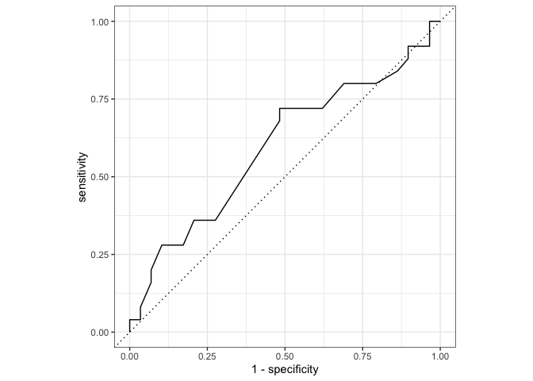

Week7
================
Thomas Rosenthal

05/03/2021

## Weekly Reflection: First Tidy Model

<sub> spoiler: it sucks </sub>

I had a bit too much optimism going into this week’s modelling. At last,
I’m getting to write a model based on all of this super interesting
data\! Following a rough two weeks of Bayesian modelling for another
project, it was nice to come back to the land of coffee and start to see
the [fruits](https://coffeechronicler.com/coffee-cherry-taste/) of my
labour.

A binomial model shouldn’t be too much to ask for, right? After all,
it’s literally the
*[second](https://www.tidymodels.org/start/recipes/)* article of
Tidymodel’s “Get Started” series. Let’s dive right in.

### Not enough data…not even remotely enough data

I realized this a couple of weeks ago. The scrapers are working, but the
sites aren’t updating fast enough. I’ve started to supplement with some
manually collected data in the meanwhile. This project was always
envisioned to be at least a year long. Instead, it’s being squeezed into
13 weeks, alongside two other courses. Silly me.

Nonetheless, let’s get it loaded.

We’ll start with a lovely bulk loading function from
[this](https://stackoverflow.com/questions/11433432/how-to-import-multiple-csv-files-at-once)
write-up.

``` r
setwd('../..') #we'll need to go up a directory, because the Github Actions data is in another repo. 

read_plus <- function(flnm) {
    read_csv(flnm) %>% 
        mutate(filename = flnm) %>% 
        rename_with(str_to_title)}

#we're using = instead of <- throughout this notebook because it going to sit in a Drake workflow
raw_data = 
  list.files(path = "../Automatic_Drip/R/outputs/",
    pattern = "*.csv",
    full.names = T) %>% 
  map_df(~read_plus(.))
```

The `read_plus` function is a great addition to this process. At its
most basic, it’d look like this:

``` r
read_plus <- function(flnm) {
    read_csv(flnm)}
```

…but we can add a fair amount of useful dplyr/plyr mutations, renames,
etc to handle slight nuances in files and column names. In this case,
I’ve included the filename as a column and changed the names of
columns to title case, so they are easier to coalesce.

Perfect, let’s look at the data:

<table>

<thead>

<tr>

<th style="text-align:left;">

Roaster

</th>

<th style="text-align:left;">

Coffeename

</th>

<th style="text-align:left;">

Region

</th>

<th style="text-align:left;">

Producer

</th>

<th style="text-align:left;">

Variety

</th>

<th style="text-align:left;">

Processing

</th>

<th style="text-align:left;">

Tastingnotes

</th>

<th style="text-align:left;">

Country

</th>

<th style="text-align:left;">

Altitude

</th>

<th style="text-align:left;">

Directtrade

</th>

<th style="text-align:right;">

J

</th>

<th style="text-align:left;">

Process

</th>

<th style="text-align:left;">

Varietal

</th>

<th style="text-align:left;">

Harvet

</th>

<th style="text-align:left;">

Procesing

</th>

<th style="text-align:left;">

Url

</th>

<th style="text-align:left;">

Harvesttime

</th>

<th style="text-align:left;">

Certification

</th>

<th style="text-align:left;">

Latitude

</th>

<th style="text-align:left;">

Bean

</th>

<th style="text-align:left;">

Filename

</th>

</tr>

</thead>

<tbody>

<tr>

<td style="text-align:left;">

Atlas Coffee Club

</td>

<td style="text-align:left;">

Guatemala Huehuetenango

</td>

<td style="text-align:left;">

Huehuetenango

</td>

<td style="text-align:left;">

Cooperative IncoffeeIn

</td>

<td style="text-align:left;">

Bourbon, Typica

</td>

<td style="text-align:left;">

Washed

</td>

<td style="text-align:left;">

Cherry, milk chocolate

</td>

<td style="text-align:left;">

Guatemala

</td>

<td style="text-align:left;">

1800

</td>

<td style="text-align:left;">

NA

</td>

<td style="text-align:right;">

NA

</td>

<td style="text-align:left;">

NA

</td>

<td style="text-align:left;">

NA

</td>

<td style="text-align:left;">

NA

</td>

<td style="text-align:left;">

NA

</td>

<td style="text-align:left;">

NA

</td>

<td style="text-align:left;">

NA

</td>

<td style="text-align:left;">

NA

</td>

<td style="text-align:left;">

NA

</td>

<td style="text-align:left;">

NA

</td>

<td style="text-align:left;">

../Automatic\_Drip/R/outputs//TradeCoffee\_20210304.csv

</td>

</tr>

<tr>

<td style="text-align:left;">

Atlas Coffee Club

</td>

<td style="text-align:left;">

Kenya Nyeri

</td>

<td style="text-align:left;">

Nyeri

</td>

<td style="text-align:left;">

NA

</td>

<td style="text-align:left;">

SL-28 AA

</td>

<td style="text-align:left;">

Washed

</td>

<td style="text-align:left;">

Grapefruit, citrus, chocolate

</td>

<td style="text-align:left;">

Kenya

</td>

<td style="text-align:left;">

1900

</td>

<td style="text-align:left;">

NA

</td>

<td style="text-align:right;">

NA

</td>

<td style="text-align:left;">

NA

</td>

<td style="text-align:left;">

NA

</td>

<td style="text-align:left;">

NA

</td>

<td style="text-align:left;">

NA

</td>

<td style="text-align:left;">

NA

</td>

<td style="text-align:left;">

NA

</td>

<td style="text-align:left;">

NA

</td>

<td style="text-align:left;">

NA

</td>

<td style="text-align:left;">

NA

</td>

<td style="text-align:left;">

../Automatic\_Drip/R/outputs//TradeCoffee\_20210304.csv

</td>

</tr>

<tr>

<td style="text-align:left;">

Driftaway Coffee

</td>

<td style="text-align:left;">

CCR | Colombia Risaralda Finca Mustafa Crucero

</td>

<td style="text-align:left;">

Risaralda

</td>

<td style="text-align:left;">

Ana Mustafa

</td>

<td style="text-align:left;">

Castillo

</td>

<td style="text-align:left;">

Semi-washed

</td>

<td style="text-align:left;">

Orange, cherry, cinnamon

</td>

<td style="text-align:left;">

Colombia

</td>

<td style="text-align:left;">

1600

</td>

<td style="text-align:left;">

NA

</td>

<td style="text-align:right;">

NA

</td>

<td style="text-align:left;">

NA

</td>

<td style="text-align:left;">

NA

</td>

<td style="text-align:left;">

NA

</td>

<td style="text-align:left;">

NA

</td>

<td style="text-align:left;">

NA

</td>

<td style="text-align:left;">

October - December

</td>

<td style="text-align:left;">

NA

</td>

<td style="text-align:left;">

NA

</td>

<td style="text-align:left;">

NA

</td>

<td style="text-align:left;">

../Automatic\_Drip/R/outputs//TradeCoffee\_20210304.csv

</td>

</tr>

<tr>

<td style="text-align:left;">

Driftaway Coffee

</td>

<td style="text-align:left;">

PCA | Peru Cajamarca Nancy Mendoza Arribasplata

</td>

<td style="text-align:left;">

Cajamarca

</td>

<td style="text-align:left;">

Nancy Mendoza Arribasplata

</td>

<td style="text-align:left;">

Catimor, Pache, Bourbon

</td>

<td style="text-align:left;">

Washed

</td>

<td style="text-align:left;">

Cinnamon, vanilla, gingerbread

</td>

<td style="text-align:left;">

Peru

</td>

<td style="text-align:left;">

1800 - 1900

</td>

<td style="text-align:left;">

NA

</td>

<td style="text-align:right;">

NA

</td>

<td style="text-align:left;">

NA

</td>

<td style="text-align:left;">

NA

</td>

<td style="text-align:left;">

NA

</td>

<td style="text-align:left;">

NA

</td>

<td style="text-align:left;">

NA

</td>

<td style="text-align:left;">

August - October

</td>

<td style="text-align:left;">

NA

</td>

<td style="text-align:left;">

NA

</td>

<td style="text-align:left;">

NA

</td>

<td style="text-align:left;">

../Automatic\_Drip/R/outputs//TradeCoffee\_20210304.csv

</td>

</tr>

<tr>

<td style="text-align:left;">

Driftaway Coffee

</td>

<td style="text-align:left;">

TZI | Tanzania Mbozi Iyenga

</td>

<td style="text-align:left;">

Mbozi

</td>

<td style="text-align:left;">

Iyenga AMCOS

</td>

<td style="text-align:left;">

Bourbon, Jackson

</td>

<td style="text-align:left;">

Washed

</td>

<td style="text-align:left;">

Apricot, brown sugar, toffee

</td>

<td style="text-align:left;">

Tanzania

</td>

<td style="text-align:left;">

1675 - 1900

</td>

<td style="text-align:left;">

NA

</td>

<td style="text-align:right;">

NA

</td>

<td style="text-align:left;">

NA

</td>

<td style="text-align:left;">

NA

</td>

<td style="text-align:left;">

NA

</td>

<td style="text-align:left;">

NA

</td>

<td style="text-align:left;">

NA

</td>

<td style="text-align:left;">

July - December

</td>

<td style="text-align:left;">

NA

</td>

<td style="text-align:left;">

NA

</td>

<td style="text-align:left;">

NA

</td>

<td style="text-align:left;">

../Automatic\_Drip/R/outputs//TradeCoffee\_20210304.csv

</td>

</tr>

<tr>

<td style="text-align:left;">

Driftaway Coffee

</td>

<td style="text-align:left;">

BSN | Brazil Ecoagricola Fazenda Serra Do Cabral Natural

</td>

<td style="text-align:left;">

Chapada de Minas

</td>

<td style="text-align:left;">

Roberto and Marcelo Flanzer

</td>

<td style="text-align:left;">

Catuai

</td>

<td style="text-align:left;">

Natural

</td>

<td style="text-align:left;">

Dark chocolate, almond, toast

</td>

<td style="text-align:left;">

Brazil

</td>

<td style="text-align:left;">

1100

</td>

<td style="text-align:left;">

NA

</td>

<td style="text-align:right;">

NA

</td>

<td style="text-align:left;">

NA

</td>

<td style="text-align:left;">

NA

</td>

<td style="text-align:left;">

NA

</td>

<td style="text-align:left;">

NA

</td>

<td style="text-align:left;">

NA

</td>

<td style="text-align:left;">

April - August

</td>

<td style="text-align:left;">

NA

</td>

<td style="text-align:left;">

NA

</td>

<td style="text-align:left;">

NA

</td>

<td style="text-align:left;">

../Automatic\_Drip/R/outputs//TradeCoffee\_20210304.csv

</td>

</tr>

</tbody>

</table>

Things for the most part of what we want (the NAs are just part of this
dataset, some of these coffee details will always be sparse.)

The biggest issue is this:

``` r
nrow(raw_data %>% select(-Filename) %>% distinct())
```

    ## [1] 315

(and this is slightly inflated\!)

This on the surface doesn’t seem like too big of a deal, but there is a
ton of diversity in all of these columns, and, despite my best efforts,
needs a ton of cleaning to be sensibly transformed for a model.

Let’s pretend that cleaning was instantaneous and there wasn’t a bunch
of code that I haven’t shown here, to show some examples.

Here are some Varieties (filtered down to at least five occurrences,
otherwise this table would go and on and on…):

<table>

<thead>

<tr>

<th style="text-align:left;">

Variety1

</th>

<th style="text-align:right;">

n

</th>

</tr>

</thead>

<tbody>

<tr>

<td style="text-align:left;">

</td>

<td style="text-align:right;">

7

</td>

</tr>

<tr>

<td style="text-align:left;">

bourbon

</td>

<td style="text-align:right;">

60

</td>

</tr>

<tr>

<td style="text-align:left;">

castillo

</td>

<td style="text-align:right;">

16

</td>

</tr>

<tr>

<td style="text-align:left;">

catuai

</td>

<td style="text-align:right;">

16

</td>

</tr>

<tr>

<td style="text-align:left;">

caturra

</td>

<td style="text-align:right;">

67

</td>

</tr>

<tr>

<td style="text-align:left;">

colombia

</td>

<td style="text-align:right;">

7

</td>

</tr>

<tr>

<td style="text-align:left;">

ethiopia heirloom

</td>

<td style="text-align:right;">

6

</td>

</tr>

<tr>

<td style="text-align:left;">

ethiopian landrace

</td>

<td style="text-align:right;">

8

</td>

</tr>

<tr>

<td style="text-align:left;">

heirloom

</td>

<td style="text-align:right;">

10

</td>

</tr>

<tr>

<td style="text-align:left;">

pacas

</td>

<td style="text-align:right;">

11

</td>

</tr>

<tr>

<td style="text-align:left;">

sl28

</td>

<td style="text-align:right;">

8

</td>

</tr>

<tr>

<td style="text-align:left;">

typica

</td>

<td style="text-align:right;">

16

</td>

</tr>

<tr>

<td style="text-align:left;">

22. colombia
    </td>
    <td style="text-align:right;">
    8
    </td>
    </tr>
    </tbody>
    </table>

…and are some processing types (also filtered to five):

<table>

<thead>

<tr>

<th style="text-align:left;">

Processing1

</th>

<th style="text-align:right;">

n

</th>

</tr>

</thead>

<tbody>

<tr>

<td style="text-align:left;">

fully washed

</td>

<td style="text-align:right;">

7

</td>

</tr>

<tr>

<td style="text-align:left;">

honey

</td>

<td style="text-align:right;">

14

</td>

</tr>

<tr>

<td style="text-align:left;">

natural

</td>

<td style="text-align:right;">

33

</td>

</tr>

<tr>

<td style="text-align:left;">

pulped natural

</td>

<td style="text-align:right;">

5

</td>

</tr>

<tr>

<td style="text-align:left;">

sundried

</td>

<td style="text-align:right;">

5

</td>

</tr>

<tr>

<td style="text-align:left;">

washed

</td>

<td style="text-align:right;">

241

</td>

</tr>

</tbody>

</table>

…and we’ve got quite a lot of countries this is all spread across (still
filtered to five):

<table>

<thead>

<tr>

<th style="text-align:left;">

Country

</th>

<th style="text-align:right;">

n

</th>

</tr>

</thead>

<tbody>

<tr>

<td style="text-align:left;">

bolivia

</td>

<td style="text-align:right;">

7

</td>

</tr>

<tr>

<td style="text-align:left;">

brazil

</td>

<td style="text-align:right;">

12

</td>

</tr>

<tr>

<td style="text-align:left;">

burundi

</td>

<td style="text-align:right;">

7

</td>

</tr>

<tr>

<td style="text-align:left;">

colombia

</td>

<td style="text-align:right;">

79

</td>

</tr>

<tr>

<td style="text-align:left;">

costa rica

</td>

<td style="text-align:right;">

12

</td>

</tr>

<tr>

<td style="text-align:left;">

ecuador

</td>

<td style="text-align:right;">

12

</td>

</tr>

<tr>

<td style="text-align:left;">

el salvador

</td>

<td style="text-align:right;">

8

</td>

</tr>

<tr>

<td style="text-align:left;">

ethiopia

</td>

<td style="text-align:right;">

64

</td>

</tr>

<tr>

<td style="text-align:left;">

guatemala

</td>

<td style="text-align:right;">

34

</td>

</tr>

<tr>

<td style="text-align:left;">

honduras

</td>

<td style="text-align:right;">

14

</td>

</tr>

<tr>

<td style="text-align:left;">

kenya

</td>

<td style="text-align:right;">

13

</td>

</tr>

<tr>

<td style="text-align:left;">

mexico

</td>

<td style="text-align:right;">

5

</td>

</tr>

<tr>

<td style="text-align:left;">

panama

</td>

<td style="text-align:right;">

5

</td>

</tr>

<tr>

<td style="text-align:left;">

papua new guinea

</td>

<td style="text-align:right;">

5

</td>

</tr>

<tr>

<td style="text-align:left;">

peru

</td>

<td style="text-align:right;">

13

</td>

</tr>

<tr>

<td style="text-align:left;">

rwanda

</td>

<td style="text-align:right;">

9

</td>

</tr>

<tr>

<td style="text-align:left;">

NA

</td>

<td style="text-align:right;">

9

</td>

</tr>

</tbody>

</table>

### But let’s model it anyways\!

Alright, so what do we need to do aside from gather more data?

Here are my initial thoughts:

1)  do a bunch of data cleaning (already done\!)
2)  use a lot fewer variables
3)  filter to fewer unique possible combinations by removing unique or
    slightly unique coffees altogether
4)  keep the model as simple as possible

Let’s give it a go.

We’ll ask, “Does it Taste Fruity” (or not) based on Variety, Processing,
and Country.

Fruity is based on Trait, and we’ll go ahead and dummy this column using
fastDummies, even though future iterations of this model should use
Tidymodel’s
[step\_dummy()](https://recipes.tidymodels.org/reference/step_dummy.html)
instead. We’ll filter down to five again for each
column.

``` r
prep_data = fastDummies::dummy_cols(merged_data, select_columns = "Trait1", remove_selected_columns = TRUE) %>%
  select(Variety1, Processing1, Country,Trait1_Fruity) 

prep_data = prep_data %>% group_by(Variety1) %>% filter(n() >= 5)

prep_data = prep_data %>% group_by(Processing1) %>% filter(n() >= 5)
```

fastDummies makes this column an integer (0,1) but Tidymodel binomial
models need to be factor. I love this combination of `ifelse()` in a
mutate statement, it’s like a `case_when` but a bit easier for dealing
with two levels. We’ll name the factor levels ‘absent’ and ‘present’.

``` r
prep_data = prep_data %>% 
  mutate(Trait1_Fruity = ifelse(Trait1_Fruity ==0, 'absent','present') %>% 
  as.factor() %>% 
  structure(levels=c('absent','present')), .keep = "unused")
```

*Model Process*

1)  Train Test Split
2)  Set the model to logistic regression and engine to glm
3)  Write our Tidymodel Recipe
4)  Write our Tidymodel Workflow
5)  Fit the model
6)  Predict on our test data
7)  Evaluate

Step 1: Train Test Split. Easy, and much better than the previous ways
I’ve done this.

``` r
set.seed(555)
# Put 3/4 of the data into the training set 
data_split <- initial_split(prep_data, prop = 3/4)

# Create data frames for the two sets:
train_data <- training(data_split)
test_data  <- testing(data_split)
```

Step 2: Set the model to logistic regression and engine to glm. Also
easy, just have to look up the
[options](https://www.tidymodels.org/find/parsnip/).

``` r
lr_mod = 
  logistic_reg() %>% 
  set_engine("glm") 
```

3: Write our Tidymodel Recipe. The tutorial was a big help for this.

The `recipe()` syntax is pretty normal.

The `step_dummy()` is a nice alternative to using fastDummies

It’s good to summarize the outcome of the recipe so you understand
what’s happening.

``` r
lr_recipe <- 
  recipe(Trait1_Fruity ~ ., data = train_data) %>% 
  step_dummy(all_nominal(), -all_outcomes())

summary(lr_recipe)
```

    ## # A tibble: 4 x 4
    ##   variable      type    role      source  
    ##   <chr>         <chr>   <chr>     <chr>   
    ## 1 Variety1      nominal predictor original
    ## 2 Processing1   nominal predictor original
    ## 3 Country       nominal predictor original
    ## 4 Trait1_Fruity nominal outcome   original

Step 4: Write our Tidymodel Workflow.

Add the model, add the recipe. Nothing too complicated here (yet\!)

``` r
lr_workflow <- 
  workflow() %>% 
  add_model(lr_mod) %>% 
  add_recipe(lr_recipe)
lr_workflow
```

    ## ══ Workflow ════════════════════════════════════════════════════════════════════
    ## Preprocessor: Recipe
    ## Model: logistic_reg()
    ## 
    ## ── Preprocessor ────────────────────────────────────────────────────────────────
    ## 1 Recipe Step
    ## 
    ## ● step_dummy()
    ## 
    ## ── Model ───────────────────────────────────────────────────────────────────────
    ## Logistic Regression Model Specification (classification)
    ## 
    ## Computational engine: glm

Step 5: Fit the model

``` r
lr_fit <- 
  lr_workflow %>% 
  fit(data = train_data)
```

So, how’d it do?

(Remember that spoiler…not great).

``` r
kableExtra::kable(lr_fit %>% 
  pull_workflow_fit() %>% 
  tidy())
```

<table>

<thead>

<tr>

<th style="text-align:left;">

term

</th>

<th style="text-align:right;">

estimate

</th>

<th style="text-align:right;">

std.error

</th>

<th style="text-align:right;">

statistic

</th>

<th style="text-align:right;">

p.value

</th>

</tr>

</thead>

<tbody>

<tr>

<td style="text-align:left;">

(Intercept)

</td>

<td style="text-align:right;">

18.2656018

</td>

<td style="text-align:right;">

6522.638936

</td>

<td style="text-align:right;">

0.0028003

</td>

<td style="text-align:right;">

0.9977657

</td>

</tr>

<tr>

<td style="text-align:left;">

Variety1\_bourbon

</td>

<td style="text-align:right;">

\-0.9087274

</td>

<td style="text-align:right;">

1.806744

</td>

<td style="text-align:right;">

\-0.5029641

</td>

<td style="text-align:right;">

0.6149895

</td>

</tr>

<tr>

<td style="text-align:left;">

Variety1\_castillo

</td>

<td style="text-align:right;">

\-0.9482297

</td>

<td style="text-align:right;">

1.900681

</td>

<td style="text-align:right;">

\-0.4988895

</td>

<td style="text-align:right;">

0.6178572

</td>

</tr>

<tr>

<td style="text-align:left;">

Variety1\_catuai

</td>

<td style="text-align:right;">

\-0.4084433

</td>

<td style="text-align:right;">

1.669294

</td>

<td style="text-align:right;">

\-0.2446803

</td>

<td style="text-align:right;">

0.8067040

</td>

</tr>

<tr>

<td style="text-align:left;">

Variety1\_caturra

</td>

<td style="text-align:right;">

\-1.3026957

</td>

<td style="text-align:right;">

1.741979

</td>

<td style="text-align:right;">

\-0.7478252

</td>

<td style="text-align:right;">

0.4545656

</td>

</tr>

<tr>

<td style="text-align:left;">

Variety1\_colombia

</td>

<td style="text-align:right;">

\-0.6275663

</td>

<td style="text-align:right;">

2.156258

</td>

<td style="text-align:right;">

\-0.2910442

</td>

<td style="text-align:right;">

0.7710175

</td>

</tr>

<tr>

<td style="text-align:left;">

Variety1\_ethiopia.heirloom

</td>

<td style="text-align:right;">

0.3004668

</td>

<td style="text-align:right;">

2.219197

</td>

<td style="text-align:right;">

0.1353944

</td>

<td style="text-align:right;">

0.8923001

</td>

</tr>

<tr>

<td style="text-align:left;">

Variety1\_ethiopian.landrace

</td>

<td style="text-align:right;">

\-0.1049983

</td>

<td style="text-align:right;">

2.181323

</td>

<td style="text-align:right;">

\-0.0481351

</td>

<td style="text-align:right;">

0.9616085

</td>

</tr>

<tr>

<td style="text-align:left;">

Variety1\_heirloom

</td>

<td style="text-align:right;">

1.4313397

</td>

<td style="text-align:right;">

2.287793

</td>

<td style="text-align:right;">

0.6256421

</td>

<td style="text-align:right;">

0.5315497

</td>

</tr>

<tr>

<td style="text-align:left;">

Variety1\_pacas

</td>

<td style="text-align:right;">

19.1110372

</td>

<td style="text-align:right;">

4543.870107

</td>

<td style="text-align:right;">

0.0042059

</td>

<td style="text-align:right;">

0.9966442

</td>

</tr>

<tr>

<td style="text-align:left;">

Variety1\_sl28

</td>

<td style="text-align:right;">

1.2167576

</td>

<td style="text-align:right;">

2.150543

</td>

<td style="text-align:right;">

0.5657908

</td>

<td style="text-align:right;">

0.5715360

</td>

</tr>

<tr>

<td style="text-align:left;">

Variety1\_typica

</td>

<td style="text-align:right;">

34.1770027

</td>

<td style="text-align:right;">

4090.904357

</td>

<td style="text-align:right;">

0.0083544

</td>

<td style="text-align:right;">

0.9933342

</td>

</tr>

<tr>

<td style="text-align:left;">

Variety1\_v..colombia

</td>

<td style="text-align:right;">

\-1.7789640

</td>

<td style="text-align:right;">

2.010022

</td>

<td style="text-align:right;">

\-0.8850468

</td>

<td style="text-align:right;">

0.3761314

</td>

</tr>

<tr>

<td style="text-align:left;">

Processing1\_honey

</td>

<td style="text-align:right;">

\-14.4190178

</td>

<td style="text-align:right;">

6522.638861

</td>

<td style="text-align:right;">

\-0.0022106

</td>

<td style="text-align:right;">

0.9982362

</td>

</tr>

<tr>

<td style="text-align:left;">

Processing1\_natural

</td>

<td style="text-align:right;">

\-15.9915247

</td>

<td style="text-align:right;">

6522.638768

</td>

<td style="text-align:right;">

\-0.0024517

</td>

<td style="text-align:right;">

0.9980438

</td>

</tr>

<tr>

<td style="text-align:left;">

Processing1\_sundried

</td>

<td style="text-align:right;">

\-33.0172564

</td>

<td style="text-align:right;">

7324.248795

</td>

<td style="text-align:right;">

\-0.0045079

</td>

<td style="text-align:right;">

0.9964032

</td>

</tr>

<tr>

<td style="text-align:left;">

Processing1\_washed

</td>

<td style="text-align:right;">

\-18.5660686

</td>

<td style="text-align:right;">

6522.638636

</td>

<td style="text-align:right;">

\-0.0028464

</td>

<td style="text-align:right;">

0.9977289

</td>

</tr>

<tr>

<td style="text-align:left;">

Country\_brazil

</td>

<td style="text-align:right;">

\-2.6732075

</td>

<td style="text-align:right;">

2.040473

</td>

<td style="text-align:right;">

\-1.3100922

</td>

<td style="text-align:right;">

0.1901647

</td>

</tr>

<tr>

<td style="text-align:left;">

Country\_burundi

</td>

<td style="text-align:right;">

1.6146594

</td>

<td style="text-align:right;">

1.636567

</td>

<td style="text-align:right;">

0.9866139

</td>

<td style="text-align:right;">

0.3238319

</td>

</tr>

<tr>

<td style="text-align:left;">

Country\_colombia

</td>

<td style="text-align:right;">

1.6739657

</td>

<td style="text-align:right;">

1.286490

</td>

<td style="text-align:right;">

1.3011888

</td>

<td style="text-align:right;">

0.1931938

</td>

</tr>

<tr>

<td style="text-align:left;">

Country\_costa.rica

</td>

<td style="text-align:right;">

\-1.1680876

</td>

<td style="text-align:right;">

1.879869

</td>

<td style="text-align:right;">

\-0.6213663

</td>

<td style="text-align:right;">

0.5343586

</td>

</tr>

<tr>

<td style="text-align:left;">

Country\_ecuador

</td>

<td style="text-align:right;">

\-16.3861519

</td>

<td style="text-align:right;">

3456.748589

</td>

<td style="text-align:right;">

\-0.0047403

</td>

<td style="text-align:right;">

0.9962178

</td>

</tr>

<tr>

<td style="text-align:left;">

Country\_el.salvador

</td>

<td style="text-align:right;">

\-0.3371234

</td>

<td style="text-align:right;">

1.866980

</td>

<td style="text-align:right;">

\-0.1805715

</td>

<td style="text-align:right;">

0.8567039

</td>

</tr>

<tr>

<td style="text-align:left;">

Country\_ethiopia

</td>

<td style="text-align:right;">

NA

</td>

<td style="text-align:right;">

NA

</td>

<td style="text-align:right;">

NA

</td>

<td style="text-align:right;">

NA

</td>

</tr>

<tr>

<td style="text-align:left;">

Country\_guatemala

</td>

<td style="text-align:right;">

0.6213022

</td>

<td style="text-align:right;">

1.383606

</td>

<td style="text-align:right;">

0.4490456

</td>

<td style="text-align:right;">

0.6533988

</td>

</tr>

<tr>

<td style="text-align:left;">

Country\_honduras

</td>

<td style="text-align:right;">

\-17.8942797

</td>

<td style="text-align:right;">

4543.869988

</td>

<td style="text-align:right;">

\-0.0039381

</td>

<td style="text-align:right;">

0.9968578

</td>

</tr>

<tr>

<td style="text-align:left;">

Country\_kenya

</td>

<td style="text-align:right;">

NA

</td>

<td style="text-align:right;">

NA

</td>

<td style="text-align:right;">

NA

</td>

<td style="text-align:right;">

NA

</td>

</tr>

<tr>

<td style="text-align:left;">

Country\_mexico

</td>

<td style="text-align:right;">

\-33.1833887

</td>

<td style="text-align:right;">

4090.904342

</td>

<td style="text-align:right;">

\-0.0081115

</td>

<td style="text-align:right;">

0.9935280

</td>

</tr>

<tr>

<td style="text-align:left;">

Country\_nicaragua

</td>

<td style="text-align:right;">

34.1112443

</td>

<td style="text-align:right;">

4887.161004

</td>

<td style="text-align:right;">

0.0069798

</td>

<td style="text-align:right;">

0.9944310

</td>

</tr>

<tr>

<td style="text-align:left;">

Country\_panama

</td>

<td style="text-align:right;">

34.1112443

</td>

<td style="text-align:right;">

4887.161004

</td>

<td style="text-align:right;">

0.0069798

</td>

<td style="text-align:right;">

0.9944310

</td>

</tr>

<tr>

<td style="text-align:left;">

Country\_papua.new.guinea

</td>

<td style="text-align:right;">

\-55.0171483

</td>

<td style="text-align:right;">

7699.370945

</td>

<td style="text-align:right;">

\-0.0071457

</td>

<td style="text-align:right;">

0.9942986

</td>

</tr>

<tr>

<td style="text-align:left;">

Country\_peru

</td>

<td style="text-align:right;">

0.6995972

</td>

<td style="text-align:right;">

1.390738

</td>

<td style="text-align:right;">

0.5030403

</td>

<td style="text-align:right;">

0.6149359

</td>

</tr>

<tr>

<td style="text-align:left;">

Country\_rwanda

</td>

<td style="text-align:right;">

2.5954886

</td>

<td style="text-align:right;">

1.759266

</td>

<td style="text-align:right;">

1.4753248

</td>

<td style="text-align:right;">

0.1401253

</td>

</tr>

<tr>

<td style="text-align:left;">

Country\_tanzania

</td>

<td style="text-align:right;">

19.7752628

</td>

<td style="text-align:right;">

4612.202183

</td>

<td style="text-align:right;">

0.0042876

</td>

<td style="text-align:right;">

0.9965790

</td>

</tr>

</tbody>

</table>

Step 6: Predict on our test data

We’ll do two types of prediction, first just examine what the predicted
class label was (.pred\_class) up against the test\_data’s actual values
(Trait1\_Fruity). The second will add the probability of that class
label so we can do a ROC curve during evaluation.

``` r
pred = predict(lr_fit, test_data) %>% 
  bind_cols(test_data %>% select(Variety1, Processing1, Country, Trait1_Fruity))

pred_ROC <- 
   predict(lr_fit, test_data, type = "prob") %>% 
   bind_cols(test_data %>% select(Variety1, Processing1, Country, Trait1_Fruity)) 
```

Step 7: Evaluate

ROC Curve, compared to “not fruity”:

``` r
pred_ROC %>% 
  roc_curve(truth = Trait1_Fruity, .pred_absent) %>% 
  autoplot()
```

<!-- -->

…and a confusion matrix:

``` r
conf_mat(pred, truth = Trait1_Fruity, estimate = .pred_class)
```

    ##           Truth
    ## Prediction absent present
    ##    absent       9       7
    ##    present     16      22

…and if we weren’t suffering enough, let’s just see how bad our model
accuracy is.

``` r
accuracy(pred, truth = Trait1_Fruity, estimate = .pred_class)
```

    ## # A tibble: 1 x 3
    ##   .metric  .estimator .estimate
    ##   <chr>    <chr>          <dbl>
    ## 1 accuracy binary         0.574

Well, at least it’s not a 50|50 tossup.

There we have it, a bad, but working Tidymodel binomial model.

I think I’ll just end this with, “more later…”
